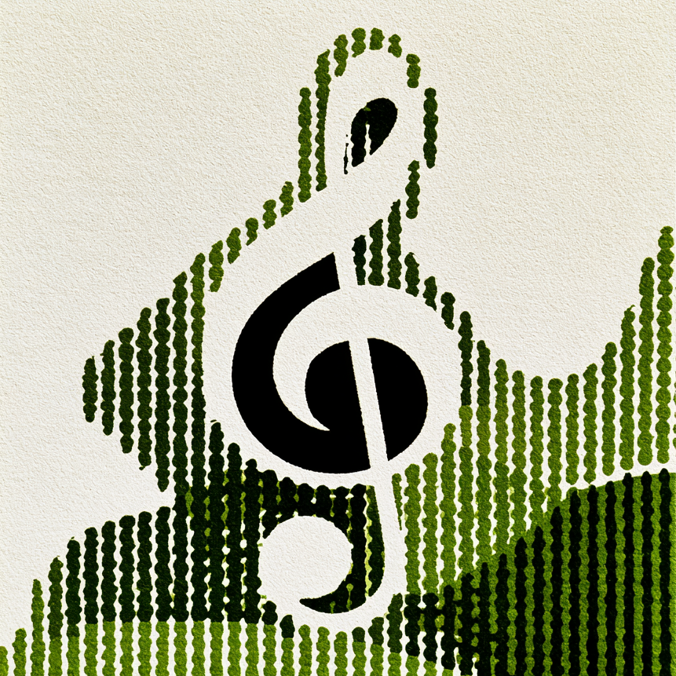
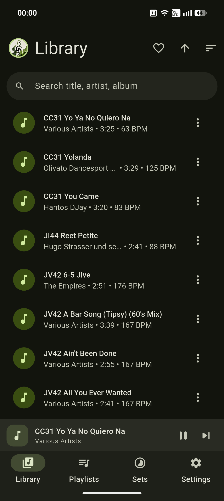
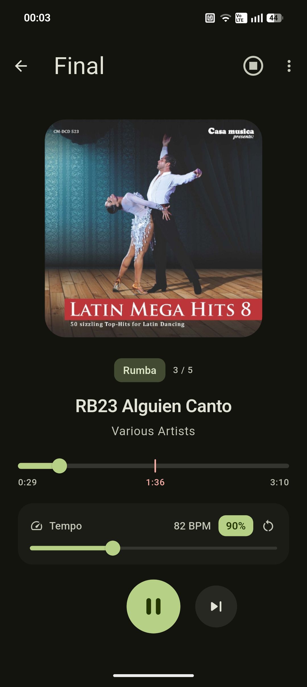
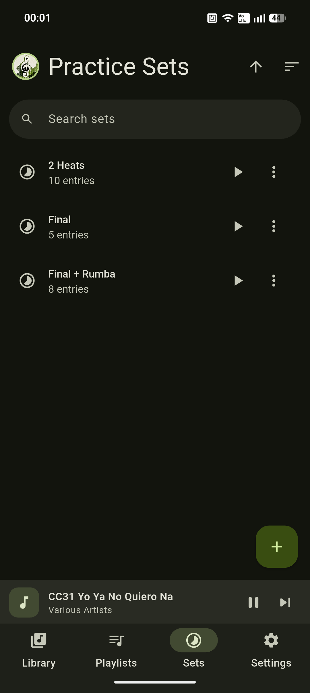
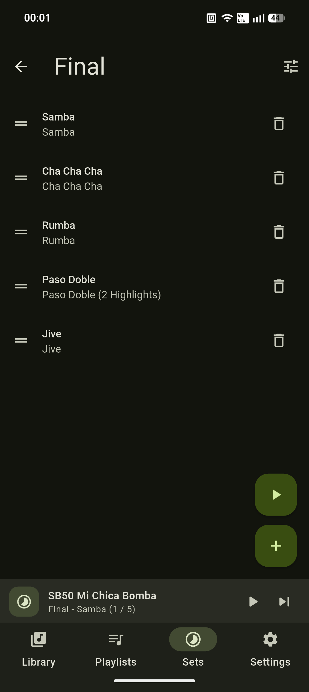
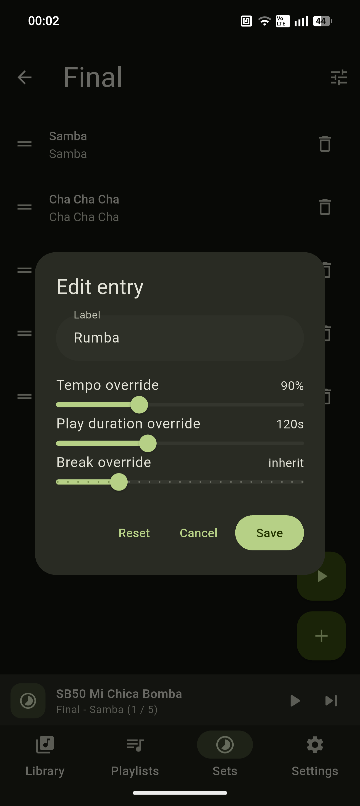

<div align="center">
  

  # intrval

  A tempo-controlled, practice-set music player for dancers.
</div>

Build ordered "practice sets" out of your playlists/folders, play a random
(or sequential) song from each in turn, with per-entry control over tempo,
play duration (with fade-out), break time, and break audio cues.

**Platform status: Android only.** See
[`docs/IOS_ROADMAP.md`](docs/IOS_ROADMAP.md) for what's missing for iOS.

## Screenshots

<p align="center">
  
  
  
  
  
</p>

## Features

- **Practice Sets** - ordered sequences of playlist/folder entries, played
  top to bottom with configurable tempo, play and break duration,
  overridable per entry.
- **Standard Player** - play any song, playlist, or folder on demand, with
  the same pitch-preserving tempo control (70%-130%, 1% steps) via a
  choice of two DSP algorithms (Rubber Band or mpv's scaletempo2).
- **Playlists** - create, reorder, and manage hand-picked song lists.
- **Library** - import and play local music, with search/sort/filter
  (including by BPM), favorites, and hide/unhide.
- **On-device BPM detection** - no network calls; estimates tempo via
  amplitude-envelope autocorrelation, with manual override/correction.
- **Break cues** - silence, a beep before the next song, or a looping
  ambient audio track, with adjustable volume.
- **Loudness controls** - an overall volume boost beyond the device's
  normal maximum, and optional per-track loudness normalization so songs
  don't jump in volume between each other.
- **Background playback** - lock-screen/notification media controls, plus
  live cover art read straight from each track's embedded tags.
- **Material You theming** - follows the device's dynamic color palette on
  Android 12+, with a few alternate seed colors (and a monochrome mode) as
  an easter egg.

## Tech stack

| Concern | Package |
| --- | --- |
| Framework | Flutter (Dart) |
| State management | `flutter_riverpod` |
| Local database | `drift` (SQLite) |
| Folder access | `saf` (Android Storage Access Framework) |
| Audio playback | `mpv_audio_kit` (libmpv + Rubber Band time-stretching) |
| Tag reading | `audio_metadata_reader` |
| BPM detection | `just_waveform` (amplitude envelope) + custom autocorrelation |
| Settings persistence | `shared_preferences` |
| Theming | `dynamic_color` + `material_color_utilities` (Material You) |

See [`docs/adr/`](docs/adr) for the reasoning behind these choices.

## Project structure

```
lib/
  core/            App-wide constants, formatting helpers, and theme.
  data/
    database/      Drift schema (tables.dart) and database class.
    repositories/   CRUD + query logic per entity (songs, playlists, folders, sets, settings).
    providers.dart  Riverpod wiring for db/repositories/services.
  services/        File import, BPM detection, audio playback (mpv_audio_kit wrapper), library scanning.
  features/        One folder per screen area: library, playlists, sets, player, settings.
  widgets/         Shared widgets (song tile, song menu, seek bar, tempo slider, dialogs).
```

## Getting started

### Prerequisites (Mac OS)

- Flutter SDK (stable channel).
- Android SDK (`cmdline-tools`, `platform-tools`, a platform image, and
  matching build-tools) with `ANDROID_HOME` set.
- A JDK compatible with this project's Gradle version - see
  [`docs/adr/0008-android-toolchain-pins.md`](docs/adr/0008-android-toolchain-pins.md)
  for toolchain history. Bleeding-edge JDKs (e.g. a `brew install openjdk` that resolves to the
  latest release) may be **too new** for Gradle; if `flutter doctor` or the
  build complains, install an LTS JDK (21) instead and point Flutter at it:
  ```
  flutter config --jdk-dir="$(brew --prefix openjdk@21)/libexec/openjdk.jdk/Contents/Home"
  ```

### Setup

```
flutter pub get
dart run build_runner build --delete-conflicting-outputs   # Drift codegen
flutter test
flutter analyze
```

### Run / build

```
flutter run                 # on a connected device/emulator
flutter build apk --debug   # produces build/app/outputs/flutter-apk/app-debug.apk
```

## Documentation

- [`docs/adr/`](docs/adr) - Architecture Decision Records for the major
  technical choices (framework, database, audio stack, BPM detection,
  storage model, Android toolchain pins).
- [`docs/TROUBLESHOOTING.md`](docs/TROUBLESHOOTING.md) - build/toolchain bugs
  encountered so far and how they were fixed.
- [`docs/IOS_ROADMAP.md`](docs/IOS_ROADMAP.md) - what's Android-specific
  today and what would need to change to support iOS.

## License

MIT - see [`LICENSE`](LICENSE).
